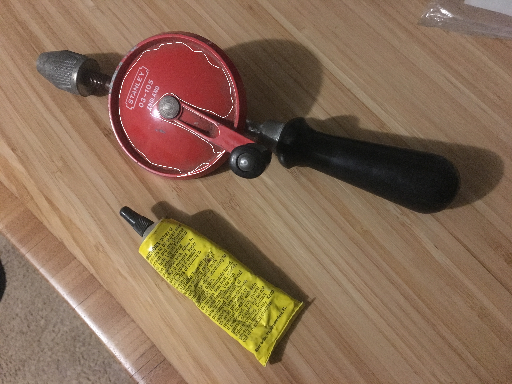

# Region Growing Perimeter Smoothing

This project consist of test.cpp and ImageProc.h source files. test.cpp is for taking parameters from terminal and perform desired command. All created functions are in ImageProc.h file.

## compile
There is just one CmakeLists.txt file and when you compile it both task1 and task2 executables will be created.
please use following commands.    
  cmake .   
  make 
  
# Run

I implemented to border tracking algorithm to determine the border of the object in (x,y) location, then I implemented Catmull-Rom algorithm to smooth the border. Executable needs one more extra parameter which indicates the coefficient of the smoothing algorithm. as you know Catmull_Rom algorithm needs 4 consecutive points on the border of the object. To smooth the border, I resample the border point. Resampling ratio depends on the given parameter. For instance if the smooth coefficient is 0.1, it means I resample the points 10 by 10. So instead of processing 0,1,2,3 point on border for Catmull_Rom algorithm, I used 0,10,20,30th point on border. So Catmull_Rom algorithm tries to interpolate sub-pixel location in using these 4 point. Maybe the size of the output of smoothing function might be determined by user. But I do not pay attention to that and I assume always smoothed curve has 2 times more point according to first found border.

To improve the smooting of the border, first I need to implement implement gaussian low pass filter to blurred given image first which was not implemented. with blurring given image, border has to be more smooth. but this step has not too many effect. Beside Catmull_Rom algorithm we can try some similar surve smoothing algorithm such as bezier curve. And also to figure out the predetermined shape such as line circle elippse, we can implement this kind of fitting algorithm as well how we generally implement stroke segmentation in hardwritten recognition problems.

To run that program. You need to give parameter from terminal as followings;
```
$ ./test <Image_Path> <startx> <starty> <threshold> <smoothcoeff> [--showimage] [--showregion] [--showperimeter] [--saveregion <regionfilename>] [--saveboundary <boundaryfilename>]
```

which mean image file , starting x and y positon , threashold for region similartiy and smoothcoeff has to be given to the api.
After that fixed parameter, you can give if you want to see image, region or perimeter on to the screen. And aslo you can write perimeter and region image into the file as well.

Following command for determining object region for test3.png image with start 100,100 points using 2 of threshodl of similarity and 0.1 for smoothing parameter. as a result perimeter image will be shown at the screen and also it will be saved n to file named peri.jpg

```
./test Inputs/test3.png 100 100 2 0.1 --showperimeter --saveperimeter Outputs/peri.jpg
```

Note that smoothing parameter has to be in range of (0 1), if you give any number out of range than api does not perform smoothing.
if you do not want to apply any smoothing basicall you can give that parameter as 0 or 1.

Here is the some results of the high reolution image under smoothcoef=0.005 and smoothcoef=0.1 uner starting point of (1500,617) and threashold=5.

<p align="center">
    
    
</p>


  
 


